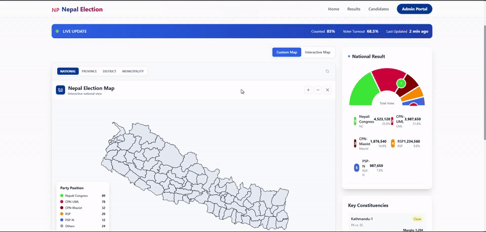
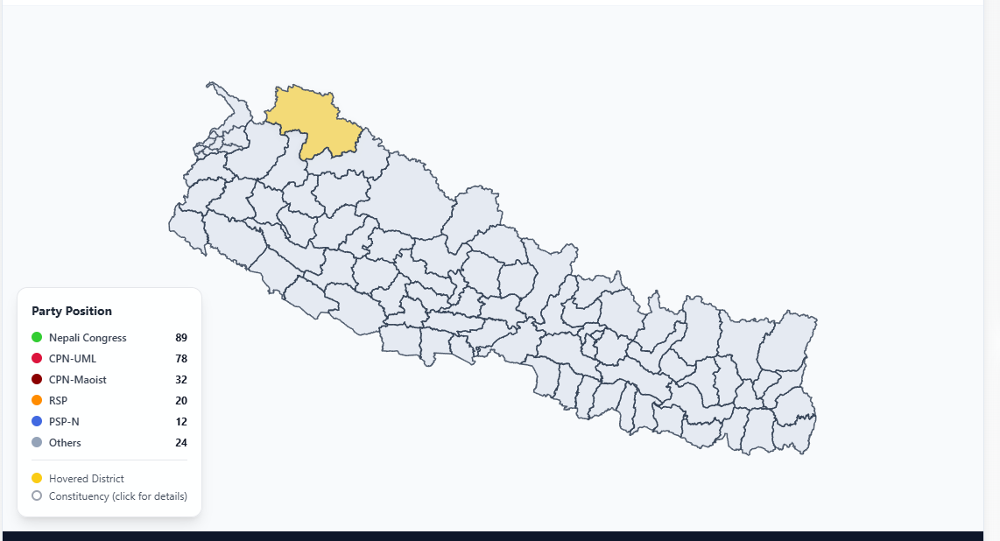

# Nepal Election Frontend (React)



A high-performance, real-time frontend for the Nepal Election monitoring system. Built with React and designed for maximum visual impact and data clarity.

## 💻 Tech Stack
- **Framework**: React 18+ (Vite)
- **State Management**: Redux Toolkit
- **Styling**: Tailwind CSS + Lucide Icons
- **Mapping**: React-Leaflet + D3.js (GeoJSON)
- **Networking**: Axios + Socket.io-client

## 🚀 Setup Instructions

1. **Install Dependencies**:
   ```bash
   npm install
   ```

2. **Environment Configuration**:
   The app connects to the API on `http://localhost:5000` by default. You can configure this in your `.env` file or within `api.js`.

3. **Run Development Server**:
   ```bash
   npm run dev
   ```
   The app will be available at `http://localhost:5173/`.

## 📁 Key Sections
- **Public Domain**: High-level maps, national summaries, and district search.
- **Admin/Staff Portal**: Secured via JWT, featuring a "Command Center" for real-time vote updates and candidate profile management.

---

## ⚖️ Copyright Notice

Copyright (c) 2026 **Chiran Raj Thapa**

**Developer Details:**
- **Name**: Chiran Raj Thapa
- **Phone**: 9813075098
- **Email**: thapachiran23@gmail.com
- **LinkedIn**: [Profile](https://www.linkedin.com/in/chiran-raj-thapa-29b185212/)
- **GitHub**: [Xiran23](https://github.com/Xiran23)

*Unauthorized use and/or duplication of this material without express and written permission from the owner is strictly prohibited.*
# Nepal-Election-Frontend
